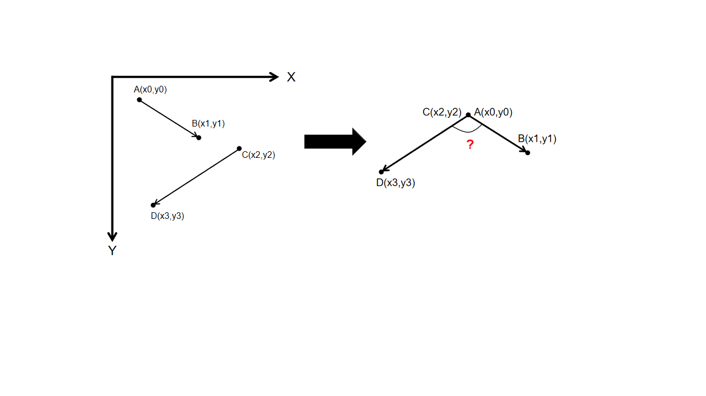
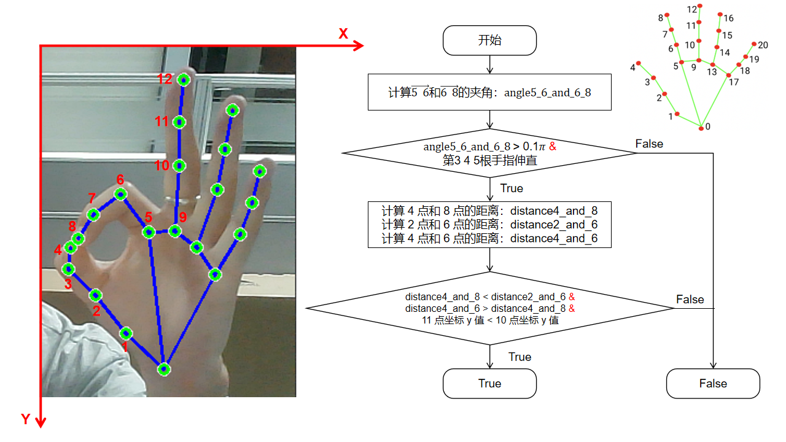
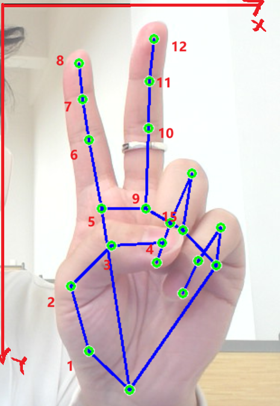
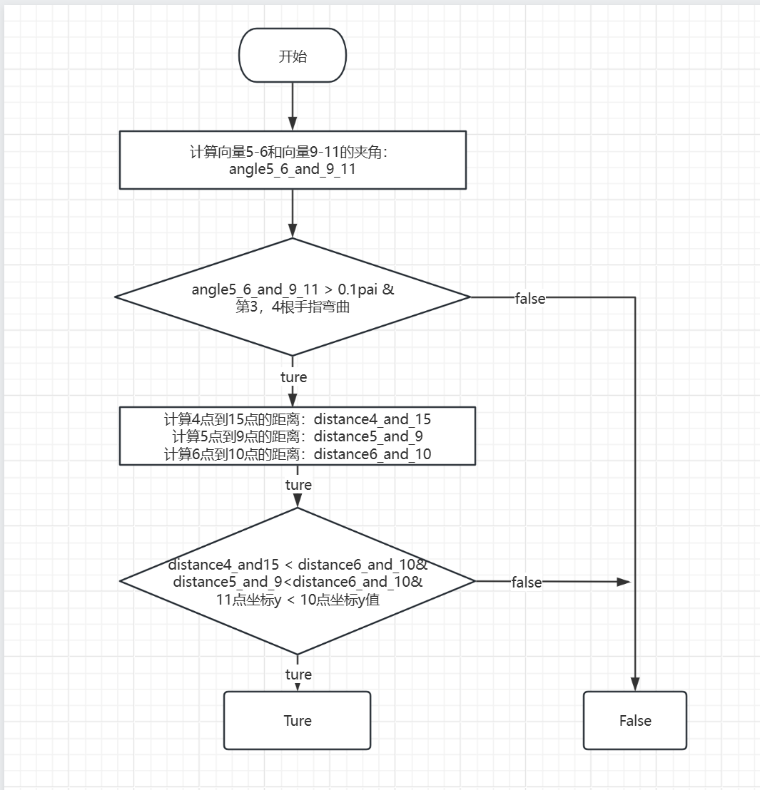

# 基于MediaPipe的手势识别

## 0. 特征

> 使用Google MediaPipe 框架.
>
> 根据github开源手势识别算法进行改写
>
> 原手势识别算法地址[WangLeYuu/Gesture-Recognition: Based on the Mediapipe framework, 6 gesture discrimination methods are provided (github.com)](https://github.com/WangLeYuu/Gesture-Recognition)

## 1. 准备工作

### 1.1 21个手指关键点信息


这个图标显示了手部关键点的结构和它们的编号。手的主要部位包括：

- **腕部 (Wrist, 0)**：手腕的中心点。
- **拇指 (Thumb)**：包含拇指的多个关键点，从根部的拇指位（1）到拇指尖（4）。
- **食指 (Index Finger)**：包括根部（5）、中节（6）和指尖（8）。
- **中指 (Middle Finger)**：同样有根部（9）和中节（10），还包括末端（11）。
- **无名指 (Ring Finger)**：有根部（13）、中节（14）和末端（15）。
- **小指 (Pinky)**：从根部（17）到小指尖（20）。

红色的点表示关键点，绿色的线展示了这些点之间的连接关系。这种表示可以用于手势识别、运动捕捉等应用。每个编号对应的部位使得对手部动作的分析和理解更加直观。

位置信息：

> ```
> WRIST = 0
> THUMB_CMC = 1
> THUMB_MCP = 2
> THUMB_IP = 3
> THUMB_TIP = 4
> INDEX_FINGER_MCP = 5
> INDEX_FINGER_PIP = 6
> INDEX_FINGER_DIP = 7
> INDEX_FINGER_TIP = 8
> MIDDLE_FINGER_MCP = 9
> MIDDLE_FINGER_PIP = 10
> MIDDLE_FINGER_DIP = 11
> MIDDLE_FINGER_TIP = 12
> RING_FINGER_MCP = 13
> RING_FINGER_PIP = 14
> RING_FINGER_DIP = 15
> RING_FINGER_TIP = 16
> PINKY_MCP = 17
> PINKY_PIP = 18
> PINKY_DIP = 19
> PINKY_TIP = 20
> ```


### 1.2 角度测量




#### 主要代码

```python
"""
计算两个点之间的距离：L2距离（欧式距离）
"""
def points_distance(x0, y0, x1, y1):
    return math.sqrt((x0 - x1) ** 2 + (y0 - y1) ** 2)
```

注：两点之间距离公式。

```python
"""
计算两条线段之间的夹角，以弧度表示
"""
def compute_angle(x0, y0, x1, y1, x2, y2, x3, y3):
    AB = [x1 - x0, y1 - y0]
    CD = [x3 - x2, y3 - y2]

    dot_product = AB[0] * CD[0] + AB[1] * CD[1]

    AB_distance = points_distance(x0, y0, x1, y1) + 0.001   # 防止分母出现0
    CD_distance = points_distance(x2, y2, x3, y3) + 0.001

    cos_theta = dot_product / (AB_distance * CD_distance)

    theta = math.acos(cos_theta)

    return theta
```

##### 主要代码解释：

1.函数 `compute_angle` 接受八个参数，分别代表两条线段的端点坐标：

- 第一条线段的端点为 A(x0,y0)*A*(*x*0,*y*0) 和 B(x1,y1)*B*(*x*1,*y*1)。
- 第二条线段的端点为 C(x2,y2)*C*(*x*2,*y*2) 和 D(x3,y3)*D*(*x*3,*y*3)。

2.计算线段 **AB** 和线段 **CD** 的向量表示：

- 向量 **AB** 的分量为 x 和 y 的差值。
- 向量 **CD** 同理。

3.计算向量 **AB** 和 **CD**的点积，公式为：

​	点积=**A**x⋅**C**x+**A**y⋅**C**y

4.通过一个名为 `points_distance` 的函数计算线段的长度，并加上一个小数值（0.001）以避免分母为零的情况。

5.使用点积和两条线段的长度计算余弦值：

​		cos⁡(θ)=点积/AB长度⋅CD长度

6.通过求反余弦计算夹角 *θ* 的弧度值

7.返回计算得出的夹角。

## 2. 使用实例（仅展示解释最简单的一个实例其余五种手势识别算法见原作者）

### 2.1 手势判断法

#### 2.1.1 OK 手势(原作者)



##### 主要代码

```python
"""  
判断是否为 OK 手势  
"""  
def judge_OK(all_points, bend_states, straighten_states):  
    # 计算点向量56、向量68之间的夹角  
    angle5_6_and_6_8 = compute_angle(  
        all_points['point5'][0], all_points['point5'][1],  # 点5的坐标 (x0, y0)  
        all_points['point6'][0], all_points['point6'][1],  # 点6的坐标 (x1, y1)  
        all_points['point6'][0], all_points['point6'][1],  # 点6的坐标 (x2, y2)，此处再次使用点6作为参考点  
        all_points['point8'][0], all_points['point8'][1]   # 点8的坐标 (x3, y3)  
    )  

    # 判断夹角是否大于18度（0.1 * π），且第3、4、5指节处于伸直状态  
    if angle5_6_and_6_8 > 0.1 * math.pi and straighten_states['third'] and straighten_states['fourth'] and straighten_states['fifth']:  
        
        # 计算点4与点8之间的距离  
        distance4_and_8 = points_distance(  
            all_points['point4'][0], all_points['point4'][1],  # 点4的坐标 (x0, y0)  
            all_points['point8'][0], all_points['point8'][1]   # 点8的坐标 (x1, y1)  
        )  
        
        # 计算点2与点6之间的距离  
        distance2_and_6 = points_distance(  
            all_points['point2'][0], all_points['point2'][1],  # 点2的坐标 (x0, y0)  
            all_points['point6'][0], all_points['point6'][1]   # 点6的坐标 (x1, y1)  
        )  
        
        # 计算点4与点6之间的距离  
        distance4_and_6 = points_distance(  
            all_points['point4'][0], all_points['point4'][1],  # 点4的坐标 (x0, y0)  
            all_points['point6'][0], all_points['point6'][1]   # 点6的坐标 (x1, y1)  
        )  
        
        # 检查条件：距离（点4到点8小于点2到点6）且（点4到点6大于点4到点8），同时点11的y坐标小于点10的y坐标  
        if distance4_and_8 < distance2_and_6 and distance4_and_6 > distance4_and_8 and all_points['point11'][1] < all_points['point10'][1]:  
            return 'OK'  # 满足条件则返回 'OK'  
        else:  
            return False  # 不满足条件返回 False  
    else:  
        return False  # 夹角过小或指节未伸直，返回 False  
```

注：其中判断手指是否弯曲伸直，手势点位置坐标获取，代码详解见谷歌官方文档（[手部特征点检测指南  | Google AI Edge  | Google AI for Developers](https://ai.google.dev/edge/mediapipe/solutions/vision/hand_landmarker?hl=zh-cn)）

### 2.2我们的扩展算法识别

#### 2.2.1 yee手势识别





##### 我们的代码：

```python
"""
判断是否为剪刀手手势
"""
def judge_Yee(all_points, bend_states, straighten_states):
    # 计算指点之间的角度
    angle5_6_and_9_11 = compute_angle(all_points['point5'][0], all_points['point5'][1], all_points['point6'][0], all_points['point6'][1],
                                       all_points['point9'][0], all_points['point9'][1], all_points['point11'][0], all_points['point11'][1])
    #计算夹角是否大于10度，而且第4，5根指头弯曲
    if angle5_6_and_9_11 > 0.1 * math.pi and bend_states['fourth'] and bend_states['fifth']:
        #计算4点到15点的距离
        distance4_15 = math.sqrt((all_points['point4'][0] - all_points['point15'][0]) ** 2 + (all_points['point4'][1] - all_points['point15'][1]) ** 2)
        #计算5点到9点的距离
        distance5_9 = math.sqrt((all_points['point5'][0] - all_points['point9'][0]) ** 2 + (all_points['point5'][1] - all_points['point9'][1]) ** 2)
        #计算6点到10点的距离
        distance6_10 = math.sqrt((all_points['point6'][0] - all_points['point10'][0]) ** 2 + (all_points['point6'][1] - all_points['point10'][1]) ** 2)
        # 检查条件：距离（点4到点15小于点6到点10）且（点5到点9的距离小于点6到点10）且 点11的坐标小于点10的y坐标
        if distance4_15 < distance6_10 and distance5_9 < distance6_10 and all_points['point11'][1] < all_points['point10'][1]:
            return 'Yee'
        else:
            return False
    else:
        return False

```


### 2.3 文件代码作用

- `gesture_judgment.py`: 改进了手指状态和手势判别方法等功能。
- `main.py`：main 函数，获取需要的关键点数据，并绘制。

## 3. 通知输出

当手势连续 30 帧不变时，将返回该手势;否则，将继续识别

## 4. 许可

本项目根据 Apache 2.0 许可证获得许可。

## 5. 鸣谢

> Github:[WangLeYuu (wly) (github.com)](https://github.com/WangLeYuu)
>
> Google：[ai.google.dev/edge/mediapipe/solutions/vision/hand_landmarker?hl=zh-cn](https://ai.google.dev/edge/mediapipe/solutions/vision/hand_landmarker?hl=zh-cn)
